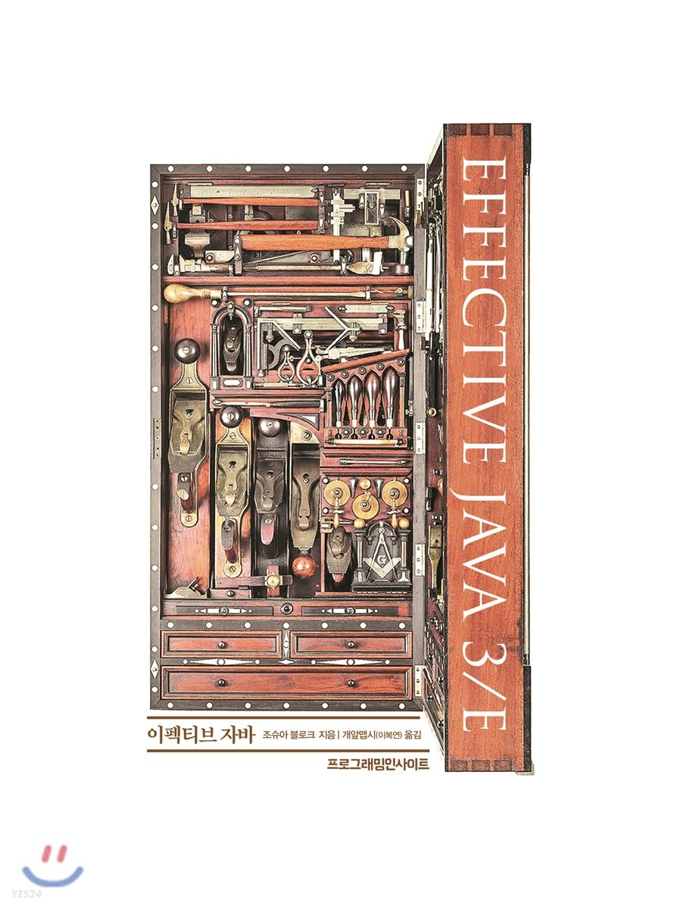

# 이펙티브 자바 3/E 학습 후기와 주요 내용 정리

## 목차

0. 시작 계기
1. 후기
2. 핵심 내용 정리 모음

----
----

## 0. 시작 계기

> 최근, zero-base 라는 플랫폼에서 진행하는 "한달한권 「이펙티브 자바」 강의" 를 보았습니다.
>
> 커리큘럼을 보아하니 15일 동안, 매일 특정 주제를 다루는 책의 내용을 해설해주는 것이더군요. 
> 
> 유익한 과정일 것 같으나, 결제 여부는 개인적으로 한번 공부해보고 난 이후로 미루었습니다.
> 
> 현시점 나에게 가장 필요한 것인가? 라는 생각을 해야 되지 않을가 싶어서요.
>
> 그래서 학습 후 정리한 내용이며 이후 공유하고자 핵심 내용들을 정리해보았습니다.

 
----
----

----
----

## 1. 후기

> 우선 책의 저자는.... 찾아보니 자바 라이브러리에 상당한 기여를 하신 분이더군요.
>
> 일단 고개숙이고 시작했습니다.
>
> (책에서도 나와있는 부분입니다.) 자바 패키지 자체를 비판하는 시선으로 보고 의견을 낼 수 있는 정도의 전문가.
>
> 구글 최고 자바 아키텍트라는 조슈아 블로크.
>
> 그리고 그런 사람이 자바를 어떻게 사용해서 프로그램을 작성해야 하는가에 대해 알려준다?
>
> Stream API 는 어떻게 좋고, 어떨때 좋고 제네릭은 언제 쓰고 등....
>
> 책의 내용을 100% 습득했다고는 확신할 수는 없지만 정말 값진 시간이었네요.
>
> 이 책은 커리어의 큰 스텝을 밟을 때마다 한번씩 읽어줘도 좋고 주기적으로 읽어도 좋을 만한 내용인 것 같습니다.
>
> 특히 이 책은 자바를 많이 활용하시는 분일 수록 더욱 많은 기술적 가치를 커질 책입니다.
>
> 여기서 자바를 많이 사용한다는 것은, 프레임워크 그 이상, 더 깊은 레벨에서 프로그래밍을 보고 읽고 설계하는 그런
>
> "0. 시작 계기" 부분에서 말씀드렸다시피  리딩? 온라인 강의 결제는 안 할것 같습니다.
>
> 해당 강의에서 많이 얻어가기 위해서는 실력을 더 쌓아야 한다는 필요성을 느낍니다.
>
> 아래 2.번부터는 책의 내용을 정리해보았습니다.
>
> 주제별로 묶여있으니 한번 훑어보시면 좋을 것같네요. 
>
> 저는 그럼 20000

----
----

## 2. 핵심 내용 정리 모음 (파일 별 정리.) 

### [DAY 1 : 객체의 생성    <---클릭 ](./notes/day1.md)

- 아이템 1~5

### [DAY 2 : 객체의 파괴     <---클릭 ](./notes/day2.md)

- 아이템 6~9

### [DAY 3 : 습관적으로 사용할 수 있는 Object의 공통 메서드 <---클릭 ](./notes/day3.md)

- 아이템 10~14

### [DAY 4 : Class 와 상속 <---클릭 ](./notes/day4.md)

- 아이템 15~19

### [DAY 5 : interface 와 Class 설계 원칙 <---클릭 ](./notes/day5.md)

- 아이템 20~25

### [DAY 6 : Generic 으로 만들어 사용하기 <---클릭 ](./notes/day6.md)

- 아이템 26~29

### [DAY 7 : Generic Method와 Generic의 주의사항 <---클릭 ](./notes/day7.md)

- 아이템 30~33

### [DAY 8 : Enum 과 Annotation의 Effective한 사용 <---클릭 ](./notes/day8.md)

- 아이템 34~41

### [DAY 9 : Lambda의 우아함과 Stream의 주의사항 <---클릭 ](./notes/day9.md)

- 아이템 42~48

### [DAY 10 : Effective한 Method와 주의사항 <---클릭 ](./notes/day10.md)

- 아이템 49~56

### [DAY 11 : Basic한 프로그래밍 원칙 1  <---클릭 ](./notes/day11.md)

- 아이템 57~63

### [DAY 12 : Basic 한 프로그래밍 원칙 2 <---클릭 ](./notes/day12.md)

- 아이템 64~68

### [DAY 13 : Exception, 과하지도 모자라지도 않게 <---클릭 ](./notes/day13.md)

- 아이템 69~77

### [DAY 14 : 동시성, 위험성과 효율 사이 <---클릭 ](./notes/day14.md)

- 아이템 78~84

### [DAY 15 : Serialize, 제대로 알고 쓰기 <---클릭 ](./notes/day15.md)

- 아이템 85~90

